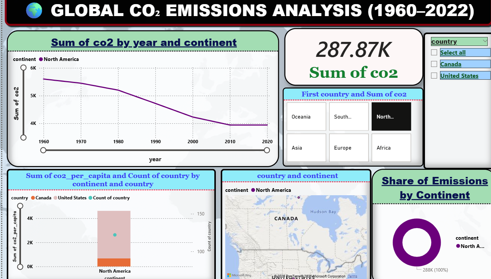

# 🌍 Global CO₂ Emissions Analysis


A **data analysis and visualization project** focused on exploring **global CO₂ emissions** trends using **Python (Seaborn)** and an **interactive Power BI dashboard**.
Designed to be beginner-friendly yet impressive enough for portfolio or interviews.

---

## 📂 Project Structure

```
global-co2-analysis/
│── README.md
│── analysis.py
│── analysis.ipynb
│── requirements.txt
│── LICENSE
│── data/
│    └── co2_data_cleaned.csv
│── plots/
│    ├── global_trend.png
│    ├── top_emitters.png
│    ├── per_capita.png
│    └── continent_trend.png
│── reports/
│    └── GLOBAL CO₂ EMISSIONS DASHBOARD.pbix
│── Key_Insights.md
```

---

## 🚀 Features

* Real dataset from **Our World in Data**
* Data cleaning: removed null, missing, and irrelevant values
* Visualizations with Seaborn:

  * 📈 Global CO₂ emissions trend (annotated lineplot)
  * 🔝 Top emitters (gradient bar chart)
  * 👤 Per capita emissions (region-colored scatterplot)
  * 🌍 Continent-wise trend over time (multi-line plot)
* Interactive **Power BI Dashboard** for storytelling and deeper insights
* Key insights documented in markdown

---

## 🛠️ Tech Stack

* Python 3.8+

  * Pandas
  * Seaborn
  * Matplotlib (minimal)
* Power BI (Dashboard Creation)

---

## 📊 Visualizations Preview

*(See `plots/` folder for generated Python plots)*

---

## 📊 Power BI Dashboard

The interactive dashboard is included in the project under `reports/`:

```
reports/GLOBAL CO₂ EMISSIONS DASHBOARD.pbix
```

**How to open:**

1. Open **Power BI Desktop**.
2. Go to **File → Open**.
3. Select the `.pbix` file.
4. Explore the interactive visuals: trends, top emitters, and continent breakdown.


### 📸 Dashboard Preview


---

## 📜 License

This project is licensed under the MIT License - see the [LICENSE](LICENSE) file for details.
